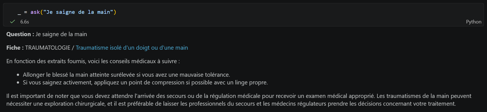

# medical-regulation-rag

A retrieval-augmented chatbot that helps French emergency call handlers (SAMU) find the relevant procedure in the *Guide d'aide à la régulation médicale* while on a call.

## Team

Keyvan Attarian, Octave Rebourseau, Arthur Fournier, Ilyes Degardin, Louis Darrigol, Nicholas Dreesen.



## Context

This repository comes from our PSC (collective scientific project) at École polytechnique, carried out with the Agence du Numérique en Santé (ANS). The question was how AI could help SAMU call centres, which face a steadily growing number of calls, without degrading care or being rejected by the people who use it.

We started with field work: semi-structured interviews with medical regulation assistants (ARM), emergency physicians and ANS staff, visits to two SAMU call centres with live call observation, and a nationwide questionnaire. The message was consistent: professionals are open to AI as an assistance tool during the call, but largely reject AI answering callers or making decisions on its own. We therefore focused on tools that support the operator rather than replace them.

The project produced two chatbots:

- a Slack bot answering questions from software vendors about the ANS technical documentation for SAMU information systems (not included here);
- **the medical regulation assistant in this repository**, built on the public guide of medical regulation with a Hugging Face integration, and tested with operators in a SAMU call centre.

## How it works

The guide contains about 190 pages (chest pain, stroke, burns, poisoning...) grouped into categories. A single question rarely needs more than one page, so the pipeline routes first and retrieves second:

```
question -> page classifier (LLM) -> retrieval restricted to that page (FAISS) -> grounded answer (LLM) + link to the page
```

1. **Routing**: the LLM receives the table of contents of the guide and picks the most relevant page. Its output is snapped to the closest existing title.
2. **Retrieval**: all pages are split into overlapping chunks and stored in one FAISS index with the page title as metadata. The search is filtered on the selected page.
3. **Answer**: the LLM answers from the retrieved passages only, is told to say when the guide does not cover the question, and the source page is always shown so the operator can check it.

All models are open-weight models from the Hugging Face Hub (`meta-llama/Llama-3.1-8B-Instruct` and `BAAI/bge-m3` by default). The notebook runs them locally when a GPU is available and otherwise calls the Hugging Face Inference API. However, local inference matters for a real deployment: health data cannot be sent to external servers, so the models would have to be hosted by the SAMU itself.

The original version used OpenAI models. This version was rewritten to run anywhere with open models.

## Quick start

```bash
pip install -r requirements.txt
export HF_TOKEN=hf_...   # free token from huggingface.co, needed without a GPU
jupyter notebook medical_regulation_rag.ipynb
```

Llama 3.1 is a gated model: accept its license once on its [Hugging Face page](https://huggingface.co/meta-llama/Llama-3.1-8B-Instruct) with the account that owns the token.

For local inference on a GPU, also install the optional packages listed at the end of `requirements.txt`.

The first run scrapes the guide and builds the index. Both are cached in `data/cache/`.

## Repository structure

```
medical_regulation_rag.ipynb   end-to-end pipeline with examples
data/guide_pages.json          categories, page titles and URLs of the guide
requirements.txt
```

## Field feedback and limitations

Operators who tested it during real calls found the answers relevant on simple cases and saw a clear time saving. The tests also showed its limits:

- questions that need information from several pages are handled poorly;
- abbreviations used in call centres, often local, are not always understood;
- speed and integration into the regulation software matter as much as answer quality;
- adding patient data would require local hosting of the models to comply with health data regulations.
